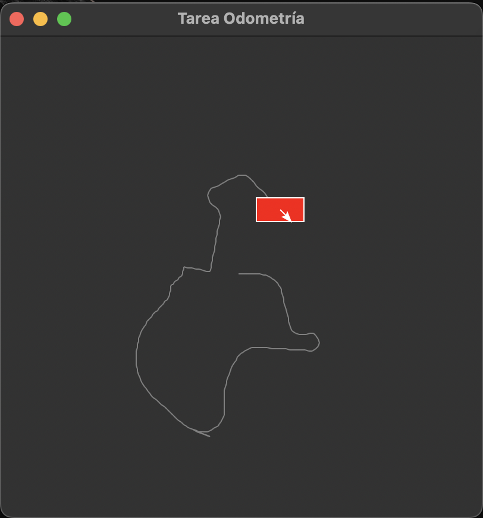

# Practica Odometría

## Índice
- [Introducción](#introducción)
    - [Requisitos](#requisitos)
    - [Uso](#uso)
- [Planteamiento](#planteamiento)
    - [Descripción del robot](#descripción-del-robot)
    - [Funcionalidades](#funcionalidades)
- [Implementación](#implementación)
    - [Clase `Robot`](#clase-robot)
        - [`__init__()`](#__init__)
        - [`move_forward()`](#move_forward)
    - [Clase `Application`](#clase-application)
        - [`__init__()`](#__init__)
        - [`key_pressed()`](#key_pressed)
        - [`draw_robot()`](#draw_robot)
- [Prueba](#prueba)

## Introducción

Esta práctica tiene como objetivo simular el movimiento de un robot utilizando odometría básica. La odometría es una técnica que utiliza la información de las ruedas del robot para estimar su movimiento relativo. En este caso, el robot se moverá en un entorno virtual representado por una ventana gráfica creada con Tkinter.

### Requisitos

- Python 3.x
- Tkinter (`tk`)
- Math
- Random

### Uso

1. Tener instalado Python 3.x.
2. Ejecuta el script.

```bash
python3 main.py
```

3. Utiliza las teclas indicadas para controlar el robot.

## Planteamiento

Se plantea un robot que se mueve en un entorno virtual. El robot tiene un ancho y un largo, así como un espaciado y un diámetro de ruedas. Además, cuenta con un codificador que mide la rotación de las ruedas. El robot comienza en una posición y orientación inicial, y se mueve en función de las teclas presionadas por el usuario.

Se ha implementado una clase `Robot` que representa al robot, y una clase `Application` que crea la ventana gráfica y controla la interacción con el usuario.

El robot implementa funcionalidades extra como errores no sistemáticos aleatorios y que no se pueda salir del canva generado en ningún momento, cuando llegue a un limite el robot no podrá avanzar en dicha dirección.

### Descripción del robot

El robot simulado en esta práctica tiene las siguientes características:

- Dimensiones: El ancho y el largo del robot.
- Espaciado de las ruedas: La distancia entre las dos ruedas del robot.
- Diámetro de las ruedas: El tamaño de las ruedas.
- Resolución del codificador: La precisión con la que se miden las rotaciones de las ruedas.
- Posición inicial: El robot comienza en el centro de la ventana gráfica.
- Orientación inicial: El robot comienza orientado hacia la derecha (en dirección positiva del eje x).

### Funcionalidades

El robot puede moverse hacia adelante y hacia atrás, así como girar a la izquierda y a la derecha. Estos movimientos son controlados mediante las siguientes teclas:

- <kbd>i</kbd>: Avanzar hacia adelante.
- <kbd>k</kbd>: Retroceder.
- <kbd>j</kbd>: Girar a la izquierda.
- <kbd>l</kbd>: Girar a la derecha.
- <kbd>u</kbd>: Moverse en diagonal hacia adelante y a la izquierda.
- <kbd>o</kbd>: Moverse en diagonal hacia adelante y a la derecha.

## Implementación

### Clase `Robot`

#### `__init__()`

Inicializa el objeto Robot con las dimensiones, espacio entre ruedas, diámetro de las ruedas, resolución del codificador y dimensiones del lienzo.

- `dimensions` (tuple): Dimensiones (ancho, alto) del robot.
- `wheel_spacing` (float): Distancia entre las ruedas.
- `wheel_diameter` (float): Diámetro de las ruedas.
- `encoder_resolution` (int): Resolución del codificador.
- `canvas_width` (int): Ancho del lienzo.
- `canvas_height` (int): Alto del lienzo.

```py
def __init__(self, dimensions, wheel_spacing, wheel_diameter, encoder_resolution, canvas_width, canvas_height):
    self.x = canvas_width / 2
    self.y = canvas_height / 2
    self.theta = 0  # Orientation in radians
    self.dimensions = dimensions
    self.wheel_spacing = wheel_spacing
    self.wheel_diameter = wheel_diameter
    self.encoder_resolution = encoder_resolution
    self.previous_positions = [(self.x, self.y)]
    self.canvas_width = canvas_width
    self.canvas_height = canvas_height
```

#### `move_forward()`

Mueve el robot hacia adelante basándose en las distancias recorridas por las ruedas izquierda y derecha.

- `distance_left` (float): Distancia recorrida por la rueda izquierda.
- `distance_right` (float): Distancia recorrida por la rueda derecha.

```py
def move_forward(self, distance_left, distance_right):
    # Simulate non-systematic errors
    if random.random() < 0.1:
        distance_left *= random.uniform(0.9, 1.0)
        distance_right *= random.uniform(0.9, 1.0)

    # Calculate displacement for each wheel
    left_distance = (distance_left / self.encoder_resolution) * self.wheel_diameter * math.pi
    right_distance = (distance_right / self.encoder_resolution) * self.wheel_diameter * math.pi

    # Calculate forward kinematics
    distance = (left_distance + right_distance) / 2
    delta_theta = (right_distance - left_distance) / self.wheel_spacing
    self.theta += delta_theta
    delta_x = distance * math.cos(self.theta)
    delta_y = distance * math.sin(self.theta)

    # Update position if within canvas boundaries
    new_x = self.x + delta_x
    new_y = self.y + delta_y
    if 0 <= new_x < self.canvas_width and 0 <= new_y < self.canvas_height:
        self.x = new_x
        self.y = new_y
        self.previous_positions.append((self.x, self.y))
```

### Clase `Application`

#### `__init__()`

Inicializa la aplicación y crea la interfaz gráfica.

```py
def __init__(self):
    super().__init__()
    self.title("Tarea Odometría")
    canvas_width = 400
    canvas_height = 400
    self.robot = Robot(dimensions=(100, 50), wheel_spacing=20, wheel_diameter=10, encoder_resolution=100,
                                    canvas_width=canvas_width, canvas_height=canvas_height)
    self.canvas = tk.Canvas(self, width=canvas_width, height=canvas_height)
    self.canvas.pack()
    self.bind('<KeyPress>', self.key_pressed)
    self.draw_robot()
```

#### `key_pressed()`

Manejador de eventos para eventos de presión de teclas.

- `event` (tk.Event): El evento de presión de tecla.

```py
def key_pressed(self, event):
    key = event.char
    if key == 'i':
        self.robot.move_forward(10, 10)
    elif key == 'k':
        self.robot.move_forward(-10, -10)
    elif key == 'j':
        self.robot.move_forward(-10, 10)
    elif key == 'l':
        self.robot.move_forward(10, -10)
    elif key == 'u':
        self.robot.move_forward(10, 3)
    elif key == 'o':
        self.robot.move_forward(3, 10)
    self.draw_robot()
```

#### `draw_robot()`

Dibuja el robot y la ruta que ha seguido en el lienzo.

```py
def draw_robot(self):
    self.canvas.delete('robot')
    x, y = self.robot.x, self.robot.y
    theta = self.robot.theta
    # Draw trail
    for i in range(len(self.robot.previous_positions) - 1):
        x1, y1 = self.robot.previous_positions[i]
        x2, y2 = self.robot.previous_positions[i + 1]
        self.canvas.create_line(x1, y1, x2, y2, fill='gray', tag='robot')
    # Draw robot body
    self.canvas.create_rectangle(x - 20, y - 10, x + 20, y + 10, fill='red', tag='robot')
    # Draw orientation
    x_orientation = x + 15 * math.cos(theta)
    y_orientation = y + 15 * math.sin(theta)
    self.canvas.create_line(x, y, x_orientation, y_orientation, fill='white', arrow=tk.LAST, tag='robot')

```

## Prueba


