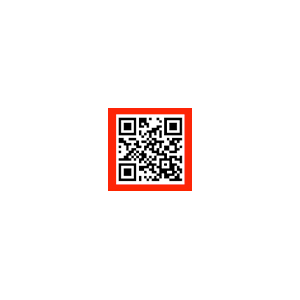
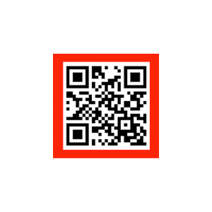
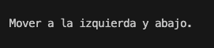

# Practica OpenCV

## Índice
- [Introducción](#introducción)
    - [Requisitos](#requisitos)
    - [Uso](#uso)
- [Planteamiento](#planteamiento)
- [Funciones](#funciones)
    - [`searchRedSquare(image)`](#searchredsquareimage)
    - [`existQR(image)`](#existqrimage)
    - [`searchContoursQR(image)`](#searchcontoursqrimage)
    - [`handleQuadrilateral(image, approx, cnt)`](#handlequadrilateralimage-approx-cnt)
    - [`searchQRPosition(image, orientation)`](#searchqrpositionimage-orientation)
    - [`position(image, approx)`](#positionimage-approx)
    - [`calculateDistance(square)`](#calculatedistancesquare)
    - [`getCutCornerPosition(approx, width, height)`](#getcutcornerpositionapprox-width-height)
    - [`getCutSidePosition(approx, half_height)`](#getcutsidepositionapprox-half_height)
    - [`showResults(x, y, z)`](#showresultsx-y-z)
    - [`main()`](#main)
- [Pruebas y resultados](#pruebas-y-resultados)


## Introducción

Un robot móvil que navega por un entorno de oficinas equipado con un sistema de visión (una cámara) acoplado a su estructura. La idea es que la navegación se produzca mediante la lectura de códigos BIDI embebidos en un cuadrado rojo, el robot ha de situarse a una distancia concreta y en una orientación concreta.

### Requisitos

- Python 3.x
- OpenCV (`cv2`)
- NumPy (`numpy`)

### Uso

1. Tener instalados todos los requisitos.
2. Ejecuta el script.

Ejemplo:
```bash
python main.py
```

## Planteamiento

El programa se encarga de reconocer en primer lugar si hay algo de color rojo, en caso de no encontrarlo comprueba si existe el QR para alejarse o indicar que no hay un QR visible en la imágen. 

Si encuentra alguna forma de color rojo lo clasifica entre las diferentes posibilidades que podemos encontrar y realiza los cálculos necesarios para decirnos si hay que moverse hacia una posición u otra.

## Funciones

### `searchRedSquare(image)`

Esta función busca un cuadrado rojo en la imagen proporcionada y determina movimientos en función de su presencia y posición. Si no se encuentra un cuadrado rojo, verifica si hay un código QR en la imagen y actúa en consecuencia.

```py
def searchRedSquare(image):
    x = y = z = None
    hsv = cv2.cvtColor(image, cv2.COLOR_BGR2HSV)
    lower_red = np.array([0, 100, 100])
    upper_red = np.array([10, 255, 255])
    mask = cv2.inRange(hsv, lower_red, upper_red)
    contours, _ = cv2.findContours(mask, cv2.RETR_EXTERNAL, cv2.CHAIN_APPROX_SIMPLE)

    if not contours:
        if existQR(image):
            z = -1
    else:
        for cnt in contours:
            approx = cv2.approxPolyDP(cnt, 0.01 * cv2.arcLength(cnt, True), True)

            if len(approx) == 4:  # Square or rectangle
                x, y, z = handleQuadrilateral(image, approx, cnt)
            elif len(approx) in [6, 8]:  # Cut shapes
                x, y = position(image, approx)
                z = None  # Distance calculation is not provided for cut shapes

    showResults(x, y, z)
```

### `existQR(image)`

Esta función comprueba si existe un código QR en la imagen proporcionada. Utiliza la función `searchContoursQR(image)` para buscar contornos de códigos QR en la imagen, y devuelve True si encuentra al menos un contorno, lo que indica la presencia de un código QR.

```py
def existQR(image):
    return len(searchContoursQR(image)) > 0
```

### `searchContoursQR(image)`

Esta función busca contornos de códigos QR en la imagen identificando el color negro. Convierte la imagen a espacio de color HSV y luego aplica un filtro para detectar regiones de color negro. A partir de estas regiones, encuentra los contornos y los devuelve para su posterior procesamiento.

```py
def searchContoursQR(image):
    hsv = cv2.cvtColor(image, cv2.COLOR_BGR2HSV)
    lower_black = np.array([0, 0, 0])
    upper_black = np.array([180, 255, 30])
    mask = cv2.inRange(hsv, lower_black, upper_black)
    contours, _ = cv2.findContours(mask, cv2.RETR_EXTERNAL, cv2.CHAIN_APPROX_SIMPLE)
    return contours
```

### `handleQuadrilateral(image, approx, cnt)`

Maneja el caso cuando se detecta una forma cuadrilátera (ya sea un cuadrado o un rectángulo). En caso de ser un rectángulo, primero lo clasifica según su orientación para saber si el robot se tendría que mover hacia izquierda/derecha o hacia arriba/abajo.

```py
def handleQuadrilateral(image, approx, cnt):
    x, y, z = None, None, None
    x, y, w, h = cv2.boundingRect(cnt)
    ratio = float(w) / h
    if 0.9 <= ratio <= 1.1:  # Square
        x, y = position(image, approx)
        if existQR(image):
            z = calculateDistance(approx)
    else:  # Rectangle
        orientation = 1 if w > h else 0 # Horizontal = 1 | Vertical = 0
        if existQR(image):
            x, y = searchQRPosition(image, orientation)
            z = -1
        else:
            x, y = position(image, approx)

    return x, y, z
```

### `searchQRPosition(image, orientation)`

Busca la posición de un código QR en función de la orientación dada sabiendo que ha reconocido previamente un rectángulo, de esta manera puede comparar si hay más zonas del QR en una posición u otra y dependiendo de donde encuentre más areas pueda clasificar e indicar el movimiento.

```py
def searchQRPosition(image, orientation):
    height, width, _ = image.shape
    contours = searchContoursQR(image)
    areas = [0, 0, 0, 0]  # left, right, top, bottom

    for contour in contours:
        area = cv2.contourArea(contour)
        x, y, w, h = cv2.boundingRect(contour)
        if x + w < width / 2:
            areas[0] += area
        elif x > width / 2:
            areas[1] += area
        if y + h < height / 2:
            areas[2] += area
        elif y > height / 2:
            areas[3] += area

    if orientation == 0:  # Vertical
        return (-1 if areas[0] > areas[1] else 1), None
    else:  # Horizontal
        return None, (-1 if areas[3] > areas[2] else 1)
```

### `position(image, approx)`

Esta función determina la posición basándose en el tipo de contorno detectado. Para cuadrados, calcula la posición basándose en el centro del cuadrado. Para esquinas cortadas y lados cortados, determina la posición basándose en sus ubicaciones dentro de la imagen.

```py
def position(image, approx):
    height, width, _ = image.shape
    half_height, half_width = height / 2, width / 2
    x = y = 0

    if len(approx) == 4:  # Square
        x, y = getSquarePosition(approx, half_width, half_height)
    elif len(approx) == 6:  # Cut corner
        x, y = getCutCornerPosition(approx, width, height)
    elif len(approx) == 8:  # Cut side
        x, y = getCutSidePosition(approx, half_height)

    return x, y
```
### `calculateDistance(square)`

Esta función calcula la distancia desde el robot hasta un cuadrado basándose en el tamaño del cuadrado detectado en la imagen.

```py
def getSquarePosition(approx, half_width, half_height):
    x_approx = (approx[0][0][0] + approx[2][0][0]) / 2
    y_approx = (approx[0][0][1] + approx[1][0][1]) / 2
    x = -1 if x_approx < half_width - 5 else (1 if x_approx > half_width + 5 else 0)
    y = -1 if y_approx < half_height - 5 else (1 if y_approx > half_height + 5 else 0)
    return x, y
```

### `getCutCornerPosition(approx, width, height)`

Esta función determina la posición para formas de esquina cortada basándose en sus ubicaciones dentro de la imagen. Identifica las esquinas y decide la dirección en la que el robot necesita moverse.

```py
def getCutCornerPosition(approx, width, height):
    firstX, firstY = approx[0][0]
    secondX, secondY = approx[3][0]
    if firstY == 0 and secondX == 0:
        return -1, 1
    elif firstY == 0 and secondX == width - 1:
        return 1, 1
    elif firstX == 0 and secondY == height - 1:
        return -1, -1
    elif firstX == width - 1 and secondY == height - 1:
        return 1, -1
    return 0, 0
```

### `getCutSidePosition(approx, half_height)`

Similar a `getCutCornerPosition`, esta función determina la posición para formas de lado cortado basándose en sus ubicaciones dentro de la imagen. Identifica los lados y decide la dirección en la que el robot necesita moverse.

```py
def getCutSidePosition(approx, half_height):
    move = approx[0][0][0]
    if move == 0:
        y_approx = (approx[7][0][1] + approx[6][0][1]) / 2
        y = -1 if y_approx < half_height - 5 else (1 if y_approx > half_height + 5 else 0)
        return -1, y
    else:
        y_approx = (approx[0][0][1] + approx[1][0][1]) / 2
        y = -1 if y_approx < half_height - 5 else (1 if y_approx > half_height + 5 else 0)
        return 1, y
```

### `showResults(x, y, z)`

Esta función muestra las instrucciones de movimiento basándose en las características detectadas. Proporciona instrucciones claras sobre si moverse hacia la izquierda/derecha, arriba/abajo, o hacia adelante/atrás.

```py
def showResults(x, y, z):
    if x is None and y is None and z is None:
        movement = "No se ha encontrado ningún QR."
    elif (x in [None, 0]) and (y in [None, 0]) and z == -1:
        movement = "Retroceder."
    elif (x in [None, 0]) and (y in [None, 0]) and z == 0:
        movement = "OK. Quieto."
    else:
        movement = "Mover"
        if x == -1:
            movement += " a la izquierda"
        elif x == 1:
            movement += " a la derecha"

        if x not in [None, 0] and y not in [None, 0] and z not in [None, 0]:
            movement += ","
        elif y != 0 and z is None:
            movement += " y"

        if y == -1:
            movement += " abajo"
        elif y == 1:
            movement += " arriba"

        if z == -1:
            movement += " y retroceder"
        elif z == 1:
            movement += " y avanzar"

        movement += "."

    print(movement)
```

### `main()`

Función principal para procesar un conjunto de imágenes, detectar cuadrados rojos y mostrar resultados.

```py
def main():
    total_images = 18
    for i in range(1, total_images):
        image_path = f"Practica_OpenCV/data/entrada{i}.jpg"
        image = cv2.imread(image_path)
        if image is None:
            print(f"Error: No se pudo cargar la imagen {image_path}")
            continue

        try:
            searchRedSquare(image)
            cv2.imshow("Red Shapes", image)
            cv2.waitKey(0)
            cv2.destroyAllWindows()
        except Exception as e:
            print(f"Error: {e}")

if __name__ == "__main__":
    main()
```

## Pruebas y resultados

Para probar el programa, se proporcionaron 17 imágenes de entrada con diferentes formas y orientaciones del código QR. A continuación se muestran los resultados obtenidos para cada imagen de entrada:

| Imagen de Entrada | Resultado |
|-------------------|-----------|
|  |  |
|  |  |
|  |  |
|  |  |
|  |  |
|  |  |
|  |  |
|  |  |
|  |  |
|  |  |
|  |  |
|  |  |
|  |  |
|  |  |
|  |  |
|  |  |
|  |  |