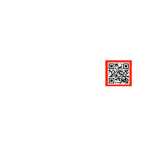

# ENUNCIADO PRÁCTICA OBLIGATORIA VISIÓN ARTIFICIAL (ROBÓTICA) FEBRERO 2024

Se plantea el siguiente contexto:

Un robot móvil que navega por un entorno de oficinas equipado con un sistema de visión (una cámara) acoplado a su estructura. La idea es que la navegación se produzca mediante la lectura de códigos BIDI embebidos en un cuadrado rojo, de la manera en la que se ve en la Figura.

  

Para una correcta lectura del código, el robot ha de situarse a una distancia concreta (por ejemplo, de 30 a 40 cm) y en una orientación concreta (por ejemplo, frontalmente con un error de 10o) respecto del cuadrado. Para ello, bastará con detectar el cuadrado dentro de la imagen capturada y comprobar la posición (con lo que calcularemos la orientación del robot) y el tamaño del cuadrado (con lo que calcularemos la distancia del robot respecto del cuadrado).

En este enunciado se plantea la solución del problema de visión artificial únicamente, sin tener en cuenta la problemática del movimiento del robot, es decir, se plantea implementar una aplicación que lea una imagen que contenga el cuadrado en diferentes posiciones y con diferentes tamaños y que dé como resultado el movimiento que el robot ha de realizar. Como ejemplo, se plantean estros tres escenarios:

|  |  |  |  |
|:-:|:-:|:-:|:-:|
| RET: "Avanzar hacia la izquierda" | RET: "Avanzar hacia adelante" | RET: "Avanzar hacia adelante y hacia la derecha" | RET: "OK. Quieto" |

Para la implementación de esta aplicación se utilizará la biblioteca de visión OPENCV
La entrada podrá ser leída directamente de disco y la salida bastará con un texto explicativo por pantalla.